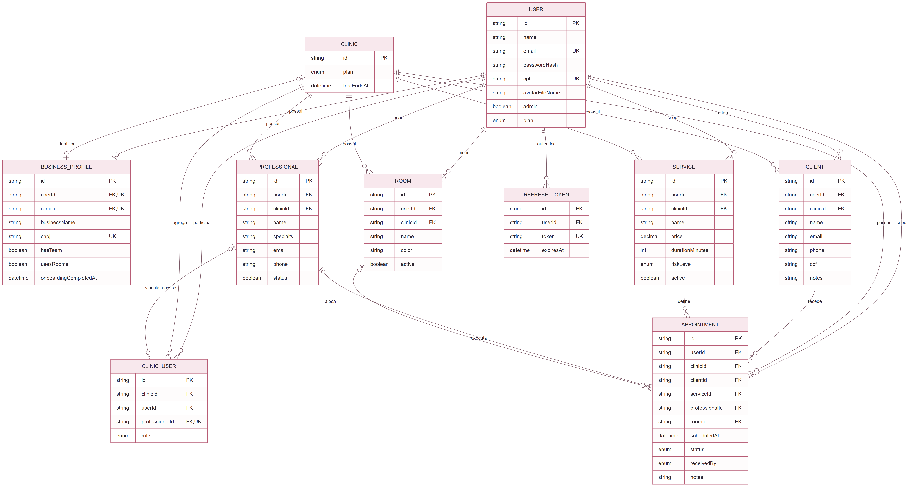
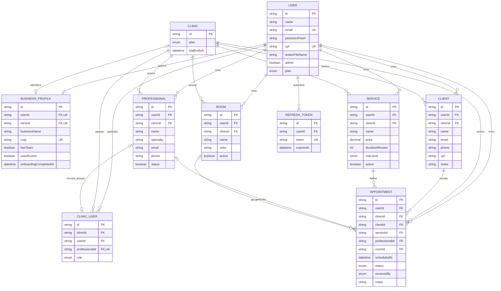
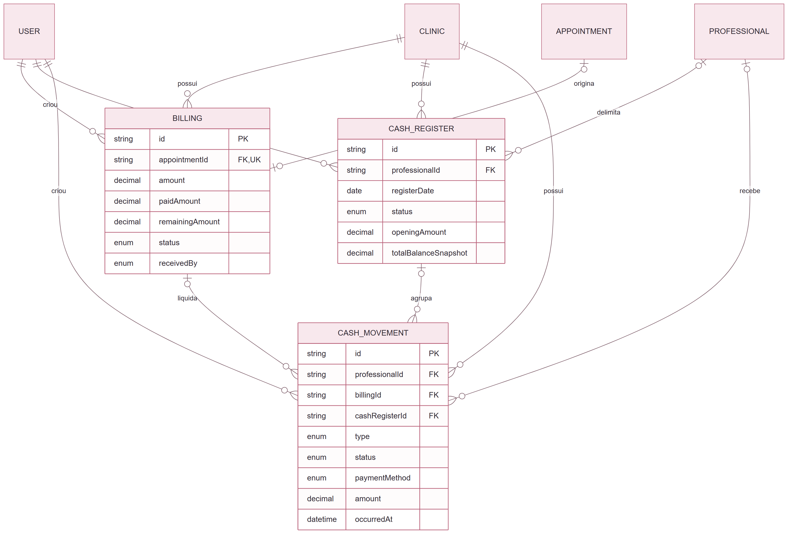
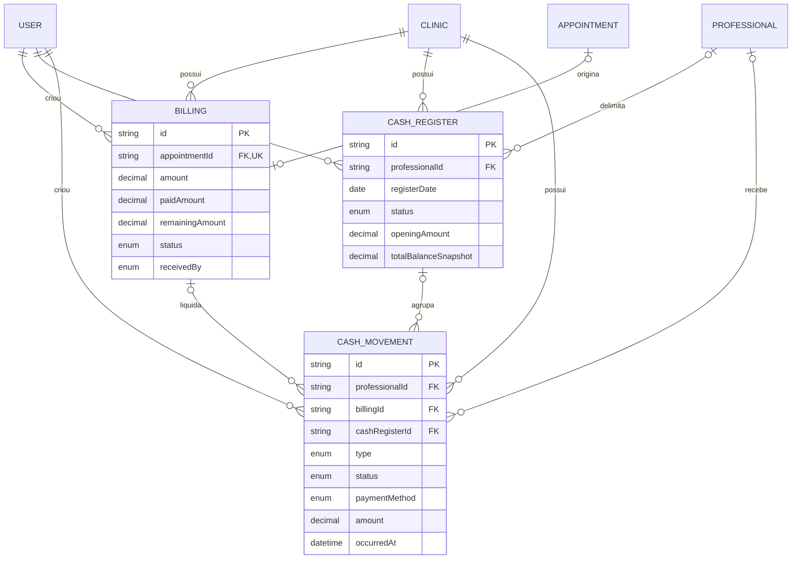

# Diagrama entidade-relacionamento

## Escopo

O aplicativo mobile não possui banco relacional próprio. O DER representa as entidades persistidas pela API que sustentam os fluxos do mobile. Campos de auditoria (`createdAt` e `updatedAt`) foram omitidos do desenho para manter a leitura; eles existem no schema Prisma.

## DER principal — núcleo usado pelo mobile

[Baixar PNG](imagens/der/01-nucleo-mobile.png) · [Abrir SVG](imagens/der/01-nucleo-mobile.svg)

## Cardinalidades e regras importantes

- Um usuário pode integrar mais de uma clínica pelo modelo, mas cada vínculo `ClinicUser` liga exatamente um usuário a uma clínica.
- `professionalId` em `ClinicUser` é opcional e único; ele associa uma conta com papel profissional ao seu cadastro operacional.
- Cada cliente, serviço, profissional, sala e agendamento pertence obrigatoriamente a uma clínica.
- Todo agendamento possui cliente e serviço; profissional e sala são opcionais no schema. A regra atual da API torna o profissional obrigatório ao criar/editar.
- CPF do cliente é único dentro da clínica; e-mail e CPF do usuário são únicos globalmente.
- O mobile usa `RefreshToken` para restaurar a sessão nativa, mas guarda no aparelho apenas o valor do token, não esta entidade completa.

## Extensão do banco ainda sem interface mobile

[Baixar PNG](imagens/der/02-extensao-financeira.png) · [Abrir SVG](imagens/der/02-extensao-financeira.svg)

O schema também possui faturamento e caixa. O desenho abaixo registra o modelo real, mas não deve ser apresentado como funcionalidade entregue no aplicativo.

Fonte de verdade: `backend/prisma/schema.prisma`.
