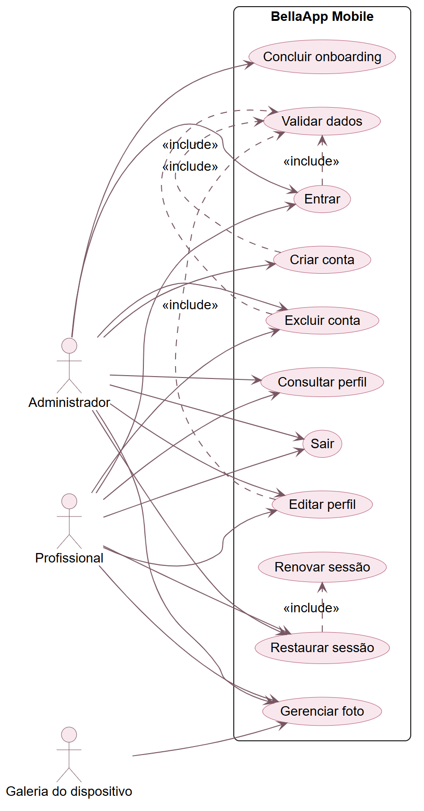
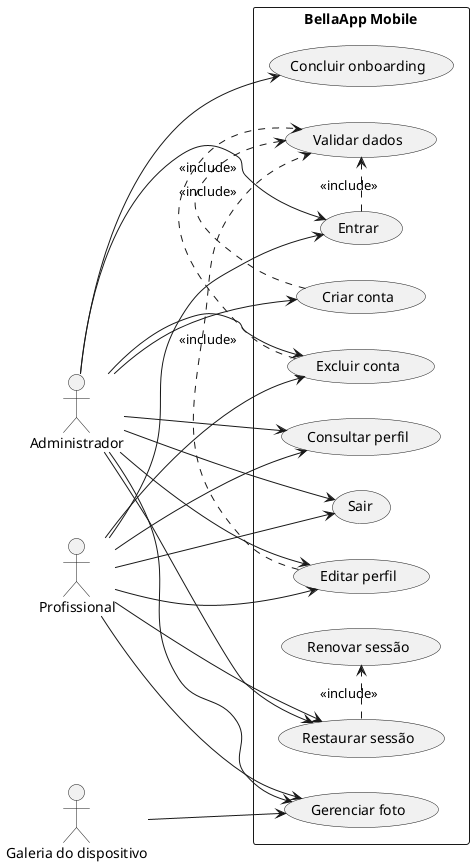
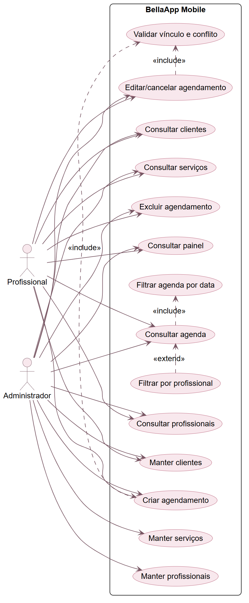
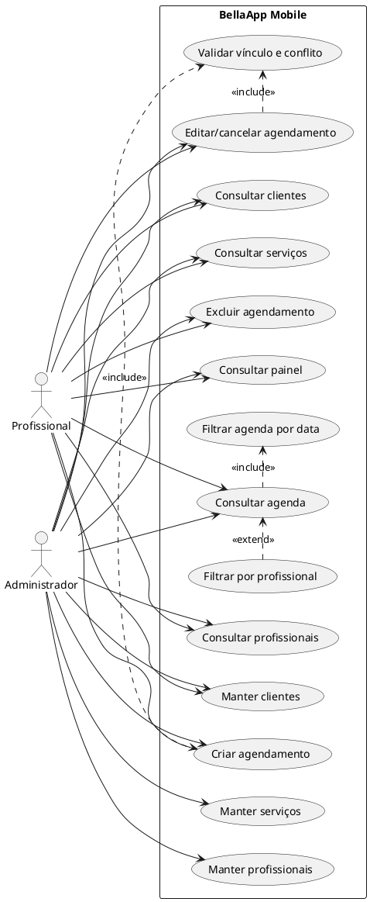

# Diagramas de casos de uso

Os dois diagramas abaixo atendem ao mínimo solicitado e separam acesso/configuração de operação da clínica.

## Caso de uso 1 — acesso, onboarding e conta

[Baixar PNG](imagens/casos-de-uso/01-acesso-e-conta.png) · [Abrir SVG](imagens/casos-de-uso/01-acesso-e-conta.svg)

Observação: a conta profissional pode ser criada/ativada por convite no backend, porém essa ativação não possui tela no mobile atual.

## Caso de uso 2 — gestão da clínica e agenda

[Baixar PNG](imagens/casos-de-uso/02-gestao-e-agenda.png) · [Abrir SVG](imagens/casos-de-uso/02-gestao-e-agenda.svg)

Restrições: o profissional só opera os próprios agendamentos conforme a API. Manutenção de serviços/profissionais é exclusiva do administrador. Um atendimento concluído permanece somente para consulta na interface atual.
