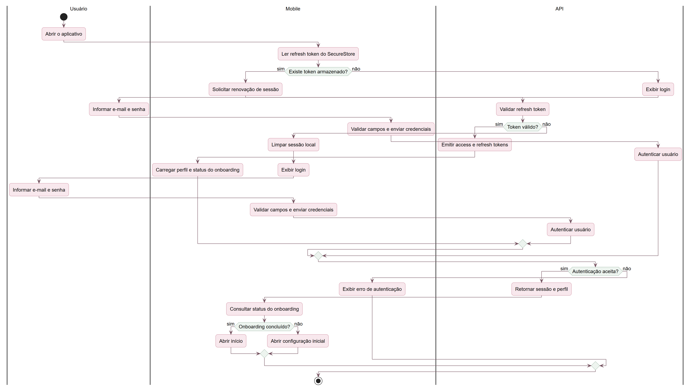
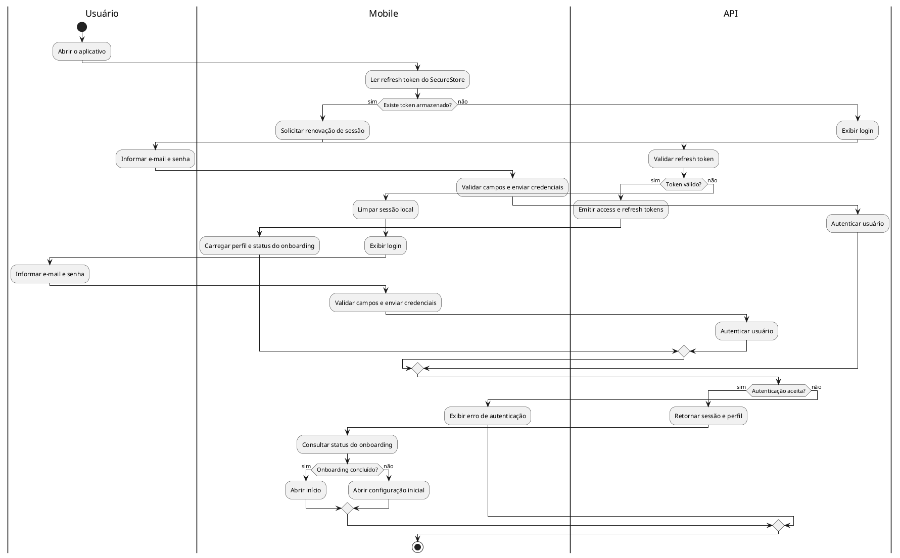
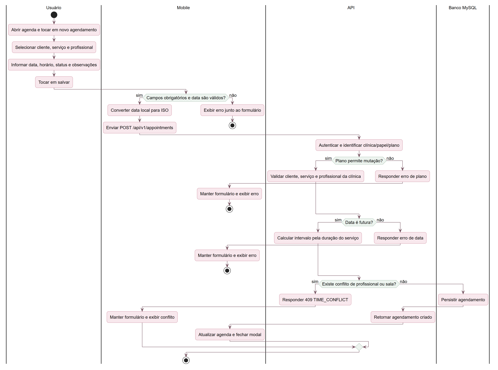
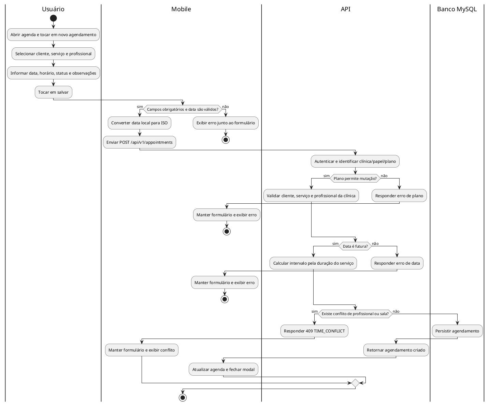

# Diagramas de atividades

## Atividade 1 — login e direcionamento inicial

[Baixar PNG](imagens/atividades/01-login-e-direcionamento.png) · [Abrir SVG](imagens/atividades/01-login-e-direcionamento.svg)

## Atividade 2 — criar agendamento

[Baixar PNG](imagens/atividades/02-criar-agendamento.png) · [Abrir SVG](imagens/atividades/02-criar-agendamento.svg)

