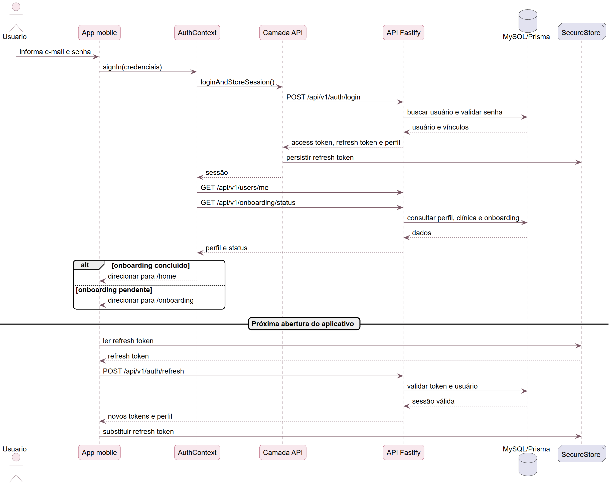
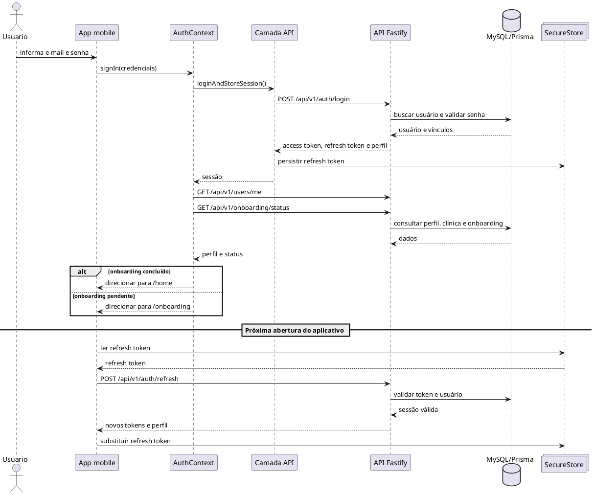
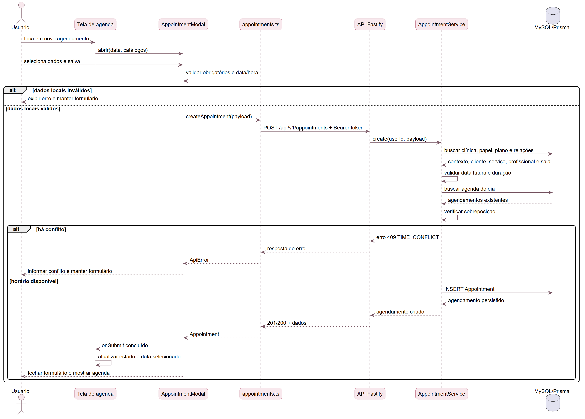
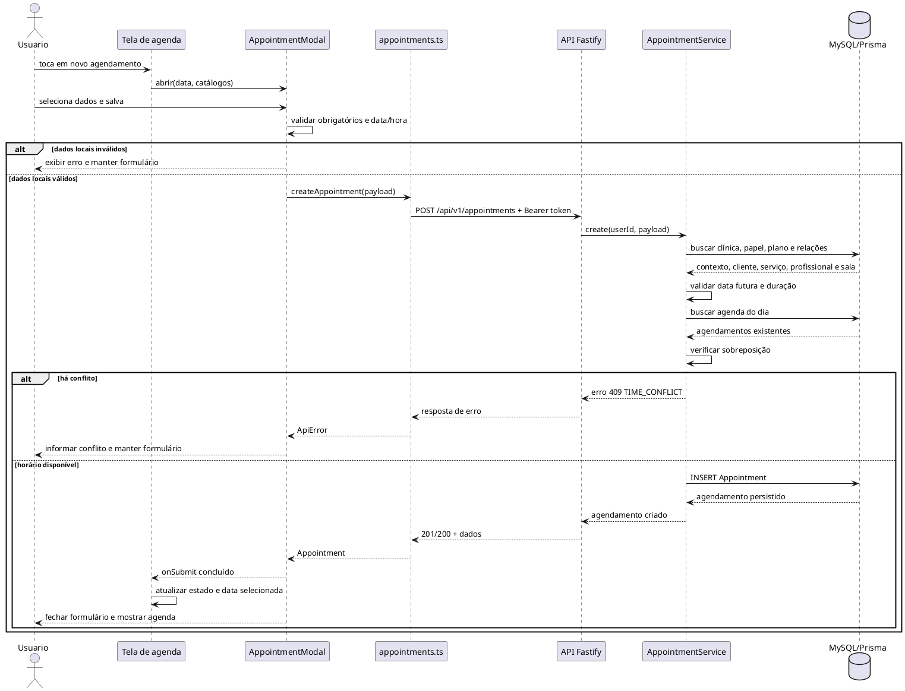

# Diagramas de sequência

## Sequência 1 — login, onboarding e restauração de sessão

[Baixar PNG](imagens/sequencia/01-login-e-sessao.png) · [Abrir SVG](imagens/sequencia/01-login-e-sessao.svg)

## Sequência 2 — criação de agendamento com conflito alternativo

[Baixar PNG](imagens/sequencia/02-criar-agendamento.png) · [Abrir SVG](imagens/sequencia/02-criar-agendamento.svg)

